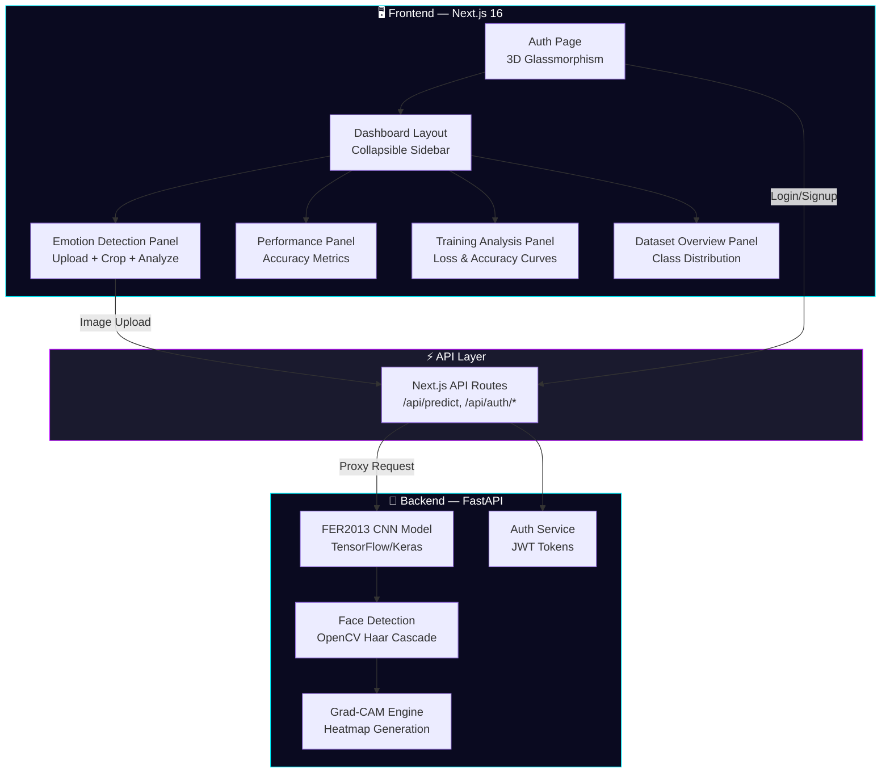

<div align="center">

<!-- Hero Banner -->


<br/>

<!-- Badges -->
[](https://nextjs.org/)
[](https://react.dev/)
[](https://www.tensorflow.org/)
[](https://fastapi.tiangolo.com/)
[](https://python.org/)
[](https://typescriptlang.org/)
[](https://tailwindcss.com/)
[](LICENSE)

<br/>

<p align="center">
  <strong>🧠 A real-time facial emotion recognition system powered by deep learning, featuring a cinematic dark-themed dashboard with 3D glassmorphism UI, Grad-CAM interpretability, and interactive data visualizations.</strong>
</p>

<br/>

<!-- Animated Divider -->


</div>

<br/>

## 🎯 Overview

**SURVI** is an end-to-end emotion surveillance platform that combines a **custom-trained CNN model** on the **FER2013 dataset** with a stunning, production-grade dashboard. Upload any face image and get instant emotion predictions with confidence scores, Grad-CAM heatmap visualizations, face bounding boxes, and interactive analytics — all wrapped in a sleek cyberpunk-themed interface.

<br/>

<div align="center">

```
┌─────────────────────────────────────────────────────────────┐
│                                                             │
│   📸 Image Upload  →  🔍 Face Detection  →  🧠 CNN Model   │
│                                                             │
│   →  📊 Emotion Prediction  →  🔥 Grad-CAM Heatmap         │
│                                                             │
│   →  📈 Interactive Dashboard Visualizations                │
│                                                             │
└─────────────────────────────────────────────────────────────┘
```

</div>

<br/>

## ✨ Key Features

<table>
<tr>
<td width="50%">

### 🧠 Deep Learning Engine
- Custom **CNN architecture** trained on FER2013
- **7 emotion classes**: Angry, Disgust, Fear, Happy, Sad, Surprise, Neutral
- **Haar Cascade** face detection with adaptive fallback
- **Grad-CAM** heatmap visualization for model interpretability
- Confidence scores for all emotion classes

</td>
<td width="50%">

### 🎨 Cinematic Dashboard
- **Dark glassmorphism** UI with neon cyan/purple accents
- **3D interactive** auth page with perspective tilt effects
- **Animated particle** backgrounds and glowing orbs
- **Framer Motion** page transitions and micro-animations
- **Responsive** 2×2 grid layout with collapsible sidebar

</td>
</tr>
<tr>
<td width="50%">

### 📊 Analytics & Visualizations
- **Interactive bar charts** — per-class accuracy breakdown
- **Training curves** — loss/accuracy line charts per epoch
- **Confusion matrix** — class-wise prediction heatmap
- **Dataset overview** — class distribution and statistics
- **Waveform visualizer** — decorative audio-wave component

</td>
<td width="50%">

### 🔐 Auth & Architecture
- **JWT-based authentication** with signup/login
- **Next.js API routes** as backend proxy (no CORS issues)
- **FastAPI** Python backend for model inference
- **Image crop tool** — draw-to-select face region before analysis
- **Heatmap toggle** — switch between original and Grad-CAM view

</td>
</tr>
</table>

<br/>

<div align="center">

</div>

<br/>

## 🏗️ Architecture



<br/>

## 🛠️ Tech Stack

<div align="center">

| Layer | Technology | Purpose |
|:---:|:---:|:---|
| **Frontend** | Next.js 16, React 19, TypeScript | Core web framework & UI |
| **Styling** | Tailwind CSS 4, Custom CSS | Dark glassmorphism theme |
| **Animation** | Framer Motion | Page transitions & micro-interactions |
| **3D** | React Three Fiber, Three.js | 3D scene components |
| **Icons** | Lucide React | Consistent icon system |
| **Backend** | FastAPI, Uvicorn | REST API for model inference |
| **ML Model** | TensorFlow / Keras | FER2013 emotion classification CNN |
| **Vision** | OpenCV, Pillow | Face detection & image processing |
| **Data** | NumPy, Pandas, scikit-learn | Training data pipeline & evaluation |
| **Dataset** | FER2013 (via KaggleHub) | 35,887 grayscale 48×48 face images |

</div>

<br/>

<div align="center">

</div>

<br/>

## 📁 Project Structure

```
emotion-surveillance/
│
├── emotion-dashboard/              # Main application
│   ├── src/
│   │   ├── app/
│   │   │   ├── page.tsx            # Entry point — auth gate + dashboard
│   │   │   ├── layout.tsx          # Root layout with metadata
│   │   │   ├── globals.css         # Global styles & theme tokens
│   │   │   └── api/
│   │   │       ├── predict/        # POST /api/predict — emotion inference
│   │   │       └── auth/           # POST /api/auth/login & signup
│   │   │
│   │   ├── components/
│   │   │   ├── auth-page.tsx       # 3D interactive login/signup
│   │   │   ├── dashboard-layout.tsx# Sidebar + header layout
│   │   │   ├── panels/
│   │   │   │   ├── emotion-detection-panel.tsx  # Image upload + crop + analysis
│   │   │   │   ├── performance-panel.tsx        # Model accuracy metrics
│   │   │   │   ├── training-analysis-panel.tsx  # Training curves
│   │   │   │   └── dataset-overview-panel.tsx   # Dataset statistics
│   │   │   ├── visualizations/
│   │   │   │   ├── bar-chart.tsx       # Interactive bar chart
│   │   │   │   ├── line-chart.tsx      # Multi-line training chart
│   │   │   │   ├── confusion-matrix.tsx# Heatmap confusion matrix
│   │   │   │   ├── heatmap.tsx         # Generic heatmap component
│   │   │   │   └── waveform.tsx        # Animated waveform
│   │   │   └── ui/
│   │   │       └── glass-panel.tsx     # Reusable glassmorphism container
│   │   │
│   │   └── lib/
│   │       ├── auth-context.tsx    # React context for auth state
│   │       ├── auth-helpers.ts     # Token management utilities
│   │       ├── mock-data.ts        # Fallback data & color mappings
│   │       └── types.ts            # TypeScript interfaces
│   │
│   ├── backend/
│   │   ├── main.py                 # FastAPI server — prediction + Grad-CAM
│   │   ├── auth.py                 # JWT auth service
│   │   ├── train_model.py          # FER2013 CNN training script
│   │   ├── requirements.txt        # Python dependencies
│   │   └── model/                  # Trained model artifacts
│   │
│   ├── package.json
│   ├── tsconfig.json
│   └── next.config.ts
│
├── .gitignore
└── README.md
```

<br/>

## 🚀 Getting Started

### Prerequisites

- **Node.js** ≥ 18.x
- **Python** ≥ 3.10
- **npm** or **yarn**

---

### 1️⃣ Clone the Repository

```bash
git clone https://github.com/itsAayushhh/emotion-surveillance.git
cd emotion-surveillance
```

### 2️⃣ Setup Frontend

```bash
cd emotion-dashboard
npm install
```

### 3️⃣ Setup Backend

```bash
cd backend
pip install -r requirements.txt
```

### 4️⃣ Train the Model *(first time only)*

```bash
python train_model.py
```

> This downloads the FER2013 dataset from Kaggle, trains the CNN, and saves the model + metrics to the `model/` directory.

### 5️⃣ Start the Backend Server

```bash
python main.py
```

The API will be available at `http://localhost:8000`

### 6️⃣ Start the Frontend

```bash
# In the emotion-dashboard directory
npm run dev
```

Open **[http://localhost:3000](http://localhost:3000)** in your browser.

<br/>

<div align="center">

</div>

<br/>

## 🧪 API Endpoints

| Method | Endpoint | Description |
|:---:|:---|:---|
| `GET` | `/` | Health check — model status |
| `POST` | `/predict` | Upload image → get emotion prediction + Grad-CAM |
| `POST` | `/auth/signup` | Create new user account |
| `POST` | `/auth/login` | Authenticate and receive JWT token |
| `GET` | `/auth/me` | Get current user from Bearer token |
| `GET` | `/metrics` | Training metrics & confusion matrix |
| `GET` | `/training-history` | Per-epoch accuracy & loss history |

<br/>

## 🎭 Supported Emotions

<div align="center">

| Emotion | Color | Description |
|:---:|:---:|:---|
| 😠 **Angry** | 🔴 `#ff4444` | Expressions of anger or frustration |
| 🤢 **Disgust** | 🟢 `#44ff44` | Expressions of disgust or displeasure |
| 😨 **Fear** | 🟣 `#ff44ff` | Expressions of fear or anxiety |
| 😊 **Happy** | 🟡 `#ffff44` | Expressions of happiness or joy |
| 😢 **Sad** | 🔵 `#4444ff` | Expressions of sadness or sorrow |
| 😲 **Surprise** | 🟠 `#ff8844` | Expressions of surprise or shock |
| 😐 **Neutral** | ⚪ `#aaaaaa` | Neutral or baseline expressions |

</div>

<br/>

## 🔬 Model Details

<div align="center">

```
╔══════════════════════════════════════════════╗
║           FER2013 CNN Architecture           ║
╠══════════════════════════════════════════════╣
║                                              ║
║   Input: 48×48×1 (Grayscale)                 ║
║       ↓                                      ║
║   Conv2D → BatchNorm → ReLU → MaxPool        ║
║       ↓                                      ║
║   Conv2D → BatchNorm → ReLU → MaxPool        ║
║       ↓                                      ║
║   Conv2D → BatchNorm → ReLU → MaxPool        ║
║       ↓                                      ║
║   Flatten → Dense → Dropout                  ║
║       ↓                                      ║
║   Dense(7) → Softmax                         ║
║       ↓                                      ║
║   Output: 7 Emotion Probabilities            ║
║                                              ║
╚══════════════════════════════════════════════╝
```

</div>

- **Dataset**: FER2013 — 35,887 labeled face images (48×48 grayscale)
- **Classes**: 7 (Angry, Disgust, Fear, Happy, Sad, Surprise, Neutral)
- **Interpretability**: Grad-CAM heatmaps highlighting facial regions that drive predictions
- **Face Detection**: OpenCV Haar Cascade with adaptive parameters and fallback

<br/>

## 🎨 Design Philosophy

<div align="center">

| Principle | Implementation |
|:---|:---|
| **Dark Cyberpunk** | Deep navy/black backgrounds with neon cyan (`#00f3ff`) and purple (`#bc13fe`) accents |
| **Glassmorphism** | Frosted glass panels with `backdrop-blur`, subtle borders, and transparency |
| **3D Interactions** | Perspective-transform card tilts on mouse movement, animated 3D logo rotation |
| **Micro-Animations** | Framer Motion staggered reveals, hover scale effects, smooth transitions |
| **Particle Effects** | Floating animated particles with randomized paths and glow orbs |
| **Data Density** | 2×2 grid layout maximizing information display across 4 interactive panels |

</div>

<br/>

<div align="center">

</div>

<br/>

## 🤝 Contributing

Contributions are welcome! Feel free to open issues or submit pull requests.

1. **Fork** the repository
2. **Create** your feature branch (`git checkout -b feature/AmazingFeature`)
3. **Commit** your changes (`git commit -m 'Add some AmazingFeature'`)
4. **Push** to the branch (`git push origin feature/AmazingFeature`)
5. **Open** a Pull Request

<br/>

## 📜 License

This project is licensed under the **MIT License** — see the [LICENSE](LICENSE) file for details.

<br/>

## 👤 Author

<div align="center">

**Aayush Patel**

[](https://github.com/itsAayushhh)

</div>

<br/>

<div align="center">


<br/>

<sub>Built with 🧠 intelligence and 💜 passion</sub>

</div>
